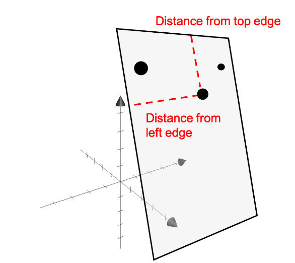



A primer to a few key concepts in linear algebra that would eventually help build the intuition behind Low Rank Adaptation (LoRA), subsequently QLoRA.

## Linear Independence

- Two vectors are considered linearly independent if neither can be expressed as a scalar multiple of the other.  
  Let us consider two vectors $\mathbf{v}, \mathbf{w} \in \mathbb{R}^2$:

  $$
  \vec{v} = \begin{bmatrix} 1 \\ 2 \end{bmatrix}, \quad \vec{w} = \begin{bmatrix} 3 \\ 4 \end{bmatrix}
  $$

  There is no scalar $c$ such that $c\vec{v} = \vec{w}$.

- No linear combination of these vectors can equal the zero vector, except when all coefficients are zero.

  $$
  \vec{v} = \begin{bmatrix} 1 \\ 2 \end{bmatrix}, \quad \vec{w} = \begin{bmatrix} 2 \\ 4 \end{bmatrix}
  $$

  There is a scalar $c = 2$ such that $2\vec{v} = \vec{w}$, so these vectors are linearly dependent.

- In general, for vectors $\vec{v}$ and $\vec{w}$, they are linearly dependent if there exist scalars $a$ and $b$, not both zero, such that:

  $$
  a\vec{v} + b\vec{w} = \vec{0}
  $$

  In the above example if $a = 2$ and $b = -1$, the equation sums to zero indicating that they are linearly dependent.

- If this equation only holds when $a = b = 0$, then the vectors are linearly independent.

## Intrinsic Dimensionality

### Intuition

Imagine you run a fruit market, and you have a collection of fruits. You want to understand the variety of fruits you have. Let’s say you have a table (matrix) where each column represents a different fruit, and each row represents a specific characteristic of that fruit, such as color, size, and taste.

|       | Apple | Cherry | Banana | Grape  |
|-------|--------|--------|--------|--------|
| Color | Red    | Red    | Yellow | Purple |
| Size  | Medium | Small  | Medium | Small  |
| Taste | Sweet  | Sweet  | Sweet  | Sweet  |

Each fruit can be considered to be a datapoint $\in \mathbb{R}^3$

**Notice something?**  
Every fruit is sweet. In other words, in this particular case, knowing the taste of the fruit will not help me identify it. Taste does not provide any additional information. I would only need to know the color and size of the fruit to identify one.

Therefore, the intrinsic dimensionality here is 2, while the extrinsic dimensionality is 3.

### Formal Definition

Source: [Wikipedia](https://en.wikipedia.org/wiki/Intrinsic_dimension)

The intrinsic dimension for a data set can be thought of as the number of variables needed in a minimal representation of the data.

*When estimating intrinsic dimension, however, a slightly broader definition based on manifold dimension is often used -*

- *a representation in the intrinsic dimension does only need to exist locally.*
- *intrinsic dimension estimation methods handle data sets with different intrinsic dimensions in different parts of the data set, often referred to as [local intrinsic dimensionality](https://en.wikipedia.org/wiki/Intrinsic_dimension#Local_Intrinsic_Dimensionality).*

Let’s consider our fruit example once again - 

It is obvious that the above set with 4 fruits is only a subset. For any realistic dataset, you’d probably have a lot more fruits (without getting into the nitty grits of what we call a “fruit”). Not all fruits are sweet. This particular subset of fruits shall have an intrinsic dimension of 2. There may be another subset that has all sweet and red fruits - there the intrinsic dimension would be 1.

The same way you can also have a subset with all three attributes having unique values, then that subset would have its intrinsic dimension = extrinsic dimension = 3.

Here’s another example:

Consider a dataset of 3-dimensional points in the given space. Think of the points on the paper as a subset of points in the dataset.  
Assume we know the position of the paper. Notice that for a point in the given subset, i.e. the paper, you would only need 2 pieces of information to determine its position. Hence, for the points on this paper, the intrinsic dimensionality is 2.

  
  
<em>Source: <a href="https://mbernste.github.io/posts/intrinsic_dimensionality/">Intrinsic dimensionality</a></em>

## Rank of a Matrix

### Notion of Vector Span and Linear Independence

  
  
<em>Fig. 1</em>

Consider Fig. 1. Notice how the three unit vectors in blue can essentially be used to represent any vector in the 3D space via a linear combination.

The red vector in this case can be obtained by the sum of the unit vectors, each scaled by an appropriate scalar constant.

Now consider Fig. 2. Notice how the two blue vectors can only describe all possible vectors on the given plane and not the entire 3D space. If I were to consider the three vectors shown on the plane in the figure, would I be able to describe all possible vectors in the extrinsic 3-dimensional space?

The answer is still “No”. Why?  
The red vector is a result of some linear combination of the two blue vectors. Thus, in essence we only have two unique vectors.

  
  
<em>Fig. 2</em>

For vectors $\bar{\mathbf{r}}, \bar{\mathbf{u}}, \bar{\mathbf{v}}, \bar{\mathbf{w}} \in \mathbb{R}^3$, if

$$
\bar{\mathbf{r}} = a\bar{\mathbf{u}} + b\bar{\mathbf{v}} + c\bar{\mathbf{w}}
$$

for some scalars $a, b, c$, then the vectors $\bar{\mathbf{u}}, \bar{\mathbf{v}}, \bar{\mathbf{w}}$ are said to span $\mathbb{R}^3$ if and only if they are linearly independent.

This leads us to the conclusion that for **$n$**-dimensional vectors to span **$\mathbb{R}^n$**:

- You need **$n$** number of vectors.
- The vectors should be linearly independent.

### Rank Intuition

The first step is to visualize what a matrix represents.

The matrix

$$
\begin{pmatrix}
x_{11} & x_{13} & x_{12} \\\
x_{21} & x_{22} & x_{23} \\\
x_{31} & x_{32} & x_{33}
\end{pmatrix}
$$
can be viewed as a set of 3 column vectors:

$$
\begin{pmatrix} x_{11} \\\ x_{21} \\\ x_{31} \end{pmatrix}, \quad
\begin{pmatrix} x_{12} \\\ x_{22} \\\ x_{32} \end{pmatrix}, \quad
\begin{pmatrix} x_{13} \\\ x_{23} \\\ x_{33} \end{pmatrix} \in \mathbb{R}^3
$$

Let’s assume the above vectors are unit vectors along the elementary axes X, Y, Z.

The figure shows that a unit cube is the smallest space in 3 dimensions that can hold these unit vectors.

Now consider another matrix made up of two arbitrary vectors:

$$
\begin{pmatrix}
x_{11} & x_{12} \\\
x_{21} & x_{22} \\\
x_{31} & x_{32}
\end{pmatrix}_{3 \times 2}
$$

is composed of

$$
\begin{pmatrix} x_{11} \\\ x_{21} \\\ x_{31} \end{pmatrix}, \quad
\begin{pmatrix} x_{12} \\\ x_{22} \\\ x_{32} \end{pmatrix} \in \mathbb{R}^3
$$

Here, we only need a 2D surface to hold the blue vectors. Hence, the minimum dimension of space needed to hold all the vectors of this matrix is 2.

  
  
<em>Fig. 3</em>

*The rank of a matrix tells you the **minimum dimension of the space** holding all the vectors of the matrix → the space spanned by the vectors.*

[*Example*](https://math.stackexchange.com/questions/39880/rank-of-a-matrix/39902#39902):  
  - If $r(A) = 3$, it means a space of at least 3 dimensions is needed to contain all the column vectors of $A$.  
  - If $r(A) = 2$, the vectors lie in a plane.  
  - If $r(A) = 1$, the vectors lie along a line. Lower rank → lower volume spanned.

### Formal Definition

- The rank of a matrix is defined as the **maximum number of linearly independent (unique) rows or columns** in the matrix. It can also be understood as the **information content** of a matrix.
- Given a matrix of size $m \times n$, the **maximum rank** is $\min(m, n)$.

Consider a matrix where $m < n$:

In an $n$-dimensional space, we have $m$-dimensional vectors. Clearly, they cannot span the space and all of them cannot be linearly independent.

**Example:**  
Let

$$
A = \begin{pmatrix}
1 & 2 & 3 & 4 \\\
0 & 1 & 2 & 3
\end{pmatrix}_{2 \times 4}
$$

Here, columns 3 and 4 can be written as linear combinations of columns 1 and 2. This can be intuitively understood via Fig. 3. We only require a 2-dimensional space to hold any 4 vectors, and thus the minimum dimension i.e. rank is 2.

  
  
<em>Fig. 4</em>

Take any $(1 \times n)$ or $(n \times 1)$ matrix. This is essentially just one vector with $\(n\)$ dimensions. The space it spans is just a line, i.e., rank = 1.

$$
\text{rank}(A) = \text{rank}(A^T)
$$

Transpose the above $\(2 \times 4\)$ matrix. This gives us a $\(4 \times 2\)$ matrix, i.e., two 4-dimensional vectors. This would be similar to the case in Figure 3. We would only be able to span a 2-dimensional plane and the rank would remain 2.

- **Row rank = Column rank.**  
- If the $\(m\)$ rows are linearly independent, then $\(n\)$ columns cannot be linearly independent, and vice versa.

- A **full rank matrix** is a matrix where all its rows (or columns) are linearly independent. This means maximum rank.

- A matrix is full-rank when the **determinant is non-zero**, which also implies that it is **invertible**.
